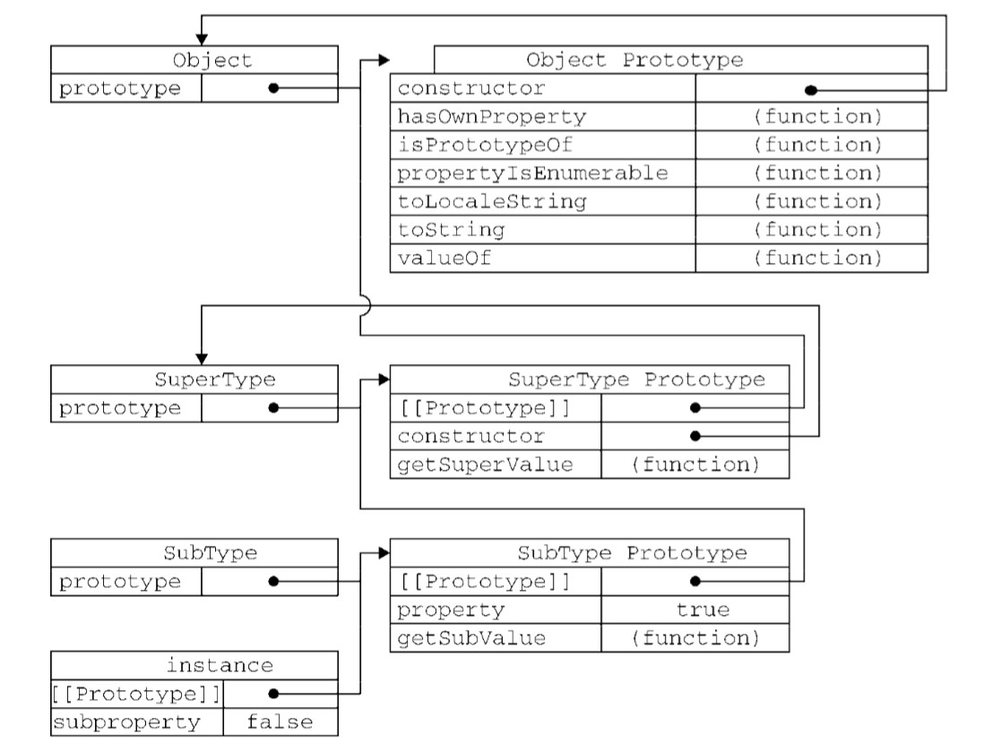

### 构造和原型继承
要想说清原型继承原理，得先理解构造关系，

* 构造：```var instance = new Constructor();```
 + 实例和构造函数的<b>原型查找</b>关系：当```instance[property]```为```undefined```时,会通过原型指针查找构造函数的原型，即```instance.__proto__ === Constructor.prototype```;这也是构成<b>原型链查找的基础</b>；
* 原型继承：```SubConstructor.prototype = new SuperConstructor()```
 + 结合构造函数和实例的原型查找关系，很容易推出SubConstructor和SuperConstructor关系，即：```SubConstructor.prototype.__proto__ === SuperConstructor.prototype```


### 构造函数继承
从如上原型继承方法不难看出，原型继承有一个致命问题:

```
function SuperConstructor(){
    this.data = [1,2,3];
}
var instance1 = new SubConstructor();
var instance2 = new SubConstructor();
instance1.data.push = 4;
console.log(instance2.data) //[1,2,3,4]
```
即所有SubConstructor的实例共享一个从SuperConstructor继承来的引用属性，相互影响，这显然不是我们想要的继承效果。

为了解决这个问题，即让每个Sub的实例各自有一份从Super继承来的引用属性，互不干扰，才引出了构造函数继承的方式，

```
function SubConstructor(){
    SuperConstructor.call(this, argus);
    this.age =25;
}
```
如上，在每次new Sub()的时候，都会在绑定Super执行上下文中this为Sub中this的前提下执行Super，即把Super中的属性赋值给了Sub的this，这样，new Sub()所返回的指向Sub实例的this就有了一份只属于自己的Super中的属性，同时也包含了Sub中的属性；

到此，可以看出构造函数继承有效解决了原型继承的问题，可这种继承方式本身也存在致命缺陷，即只能继承到Super构造函数中定义的属性和方法，原型中的属性方法全部丢失; 好奇的童鞋闷不住了，那就把属性和方法全部定义在Super构造函数中啊，这不就避免了吗。

这种说法确能避免问题，但我们不要忘了原型继承有一个很大的好处，即Super，Sub的原型prototype上定义的通用方法，我们其实并不需要每个Sub实例都自己私有一份（即不需要```instance.hasOwnProperty('commonMethod') === tue```），这无疑会增大每个实例所耗费的存储空间。理想的效果，是这些通用方法只有一份，实例通过原型指针```[[proto]]```(```__proto__```)可以调用到他们即可。


### 组合继承
综上，需要每个实例私有的属性，我们应该通过构造函数继承，而通用方法之类的东西，我们应该通过原型继承；
这就引出了组合继承方式。
```
function SubConstructor({
    SuperConstructor.call(this, argus);
    this.age = 25;
}
SubConstructor.prototype = new SuperConstructor()；
```

好奇的童鞋又问了，组合继承的情况下，Super中的data属性，即通过构造函数在赋值到了instance.data上，又通过原型继承赋值给了Sub.prototype.data，这不还是存在一份所有实例共享的data属性吗？
是的，确实是这样的，但别忘了上面说到的原型查找原理，当```instance.data```有值了，是不会再去查找```Sub.prototype.data```的, 所以这完全不影响每个实例继承来的私有属性被正确调用。


### 原型链查找
到这，继承和原型链查找原理已经很明显了。
```var instance = new SubConstructor();```

* 当我们调用instance.say时，查找若instance.hasOwnProperty('say')为false的，则通过原型指针instance.__proto__尝试调用SubConstructor.prototype.say；
* 若SubConstructor.prototype.hasOwnProperty('say')还为false， 则通过SubConstructor.prototype.__proto__尝试调用SuperConstructor.prototype.say;
* 若SuperConstructor.prototype.hasOwnProperty('say')还为false， 
 + 如手动设置过SuperConstructor的继承关系，则继续尝试通过SuperConstructor.prototype.__proto__调用超类原型上的say方法，
 + 若没有手动设置过继承关系，则是通过SuperConstructor.prototype.__proto__尝试调用Object.prototype.say,若还是未定义，则返回undefined;

注意一点，Javascript中所有的构造函数都继承自Object，而```Object.prototype.__proto__ === null```;所以Object.prototype是原型链查找的终点；

即搞基程序设计中的这张大家烂熟于心的图，不对，高级……


